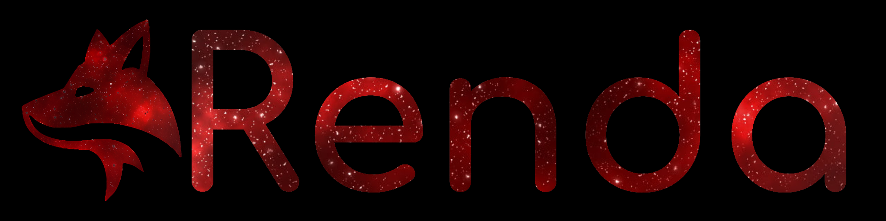
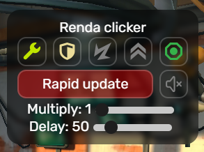

# Renda
Renda - это мощный кликер припасов для игры Танки Онлайн  

### Внимание  
⚠️ Данный проект не поддерживается. Если вы хотите продолжить работу с этим проектом, вы можете форкнуть его и поддерживать его самостоятельно.

## Установка
1. TamperMonkey - [click](https://www.tampermonkey.net)
2. Renda - [click](https://github.com/N3onTechF0X/some_TO_scripts/raw/main/Renda.user.js)

## Бинды
| **Бинд** | **Английский** | **Русский** |
|----------|--------------------------|-----------------------|
| Меню     | M                        | Ь                     |
| Мины     | '   (Quote)              | Э                     |
| Припасы  | ;   (Semicolon)          | Ж                     |   

+ Плавающая иконка на мобильных устройствах

## Лицензия

[MIT](LICENSE)

#### Разрешено:
- Коммерческое использование
- Модификация
- Распространение
- Приватное использование
#### Требования:
- Сохранение оригинального уведомления об авторских правах и лицензии во всех копиях или значимых частях программного обеспечения.
#### Отказ от гарантий:
- Программное обеспечение предоставляется "как есть", без каких-либо гарантий, явно выраженных или подразумеваемых, включая, но не ограничиваясь гарантиями товарной пригодности, соответствия для конкретной цели и отсутствия нарушений прав.
## Скриншоты
  

## Обратная связь
По всем вопросам/предложениям писать [neontechfox](https://discordapp.com/users/1086946472576159794) | Discord  
Наш [сервер discord](https://discord.gg/HyczycuQFr)  
