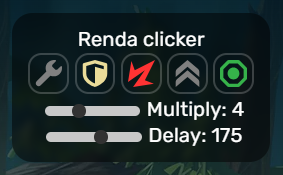

# Renda
Renda - это мощный кликер припасов для игры Танки Онлайн  

## Установка
1. TamperMonkey - [click](https://www.tampermonkey.net)
2. Renda - [click](https://github.com/N3onTechF0X/Renda/raw/main/Renda.user.js)

## Использование

### Бинды
| **Бинд** | **Английский** | **Русский** |
|----------|--------------------------|-----------------------|
| Меню     | M                        | Ь                     |
| Мины     | '   (Quote)              | Э                     |
| Припасы  | ;   (Semicolon)          | Ж                     |   

### Настройка
Вы можете изменить бинды на свои, используя консоль браузера:
```javascript
// Смена бинда меню
rendaSettings.changeBind.menu("KeyM");
// Смена бинда мин
rendaSettings.changeBind.mines("Quote");
// Смена бинда припасов
rendaSettings.changeBind.supplies("Semicolon");
// Сброс настроек
rendaSettings.resetConfig();
```

## Скриншоты


## Обратная связь
Discord - [neontechfox](https://discordapp.com/users/1086946472576159794)  
VK - [n3ontechf0x](https://vk.com/n3ontechf0x)
